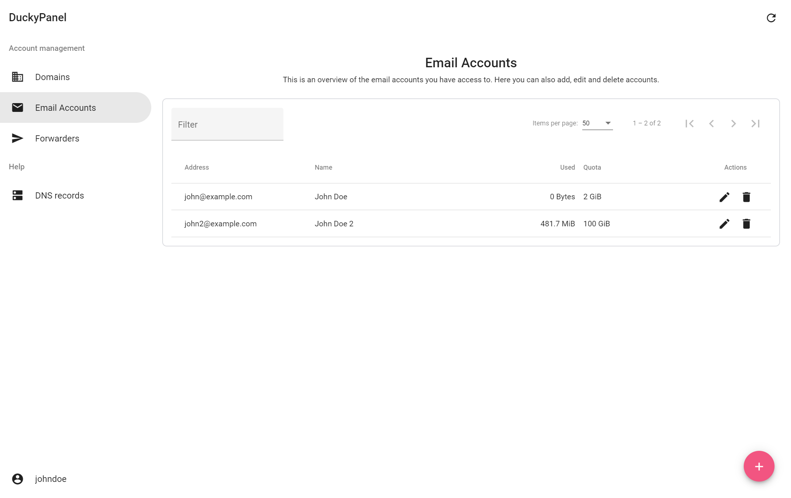
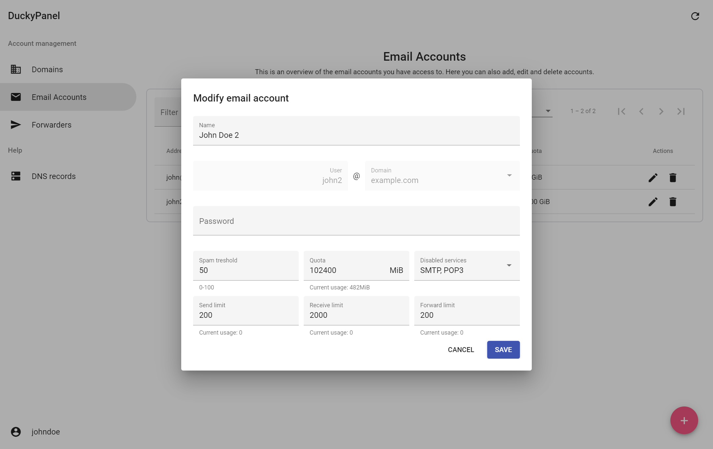
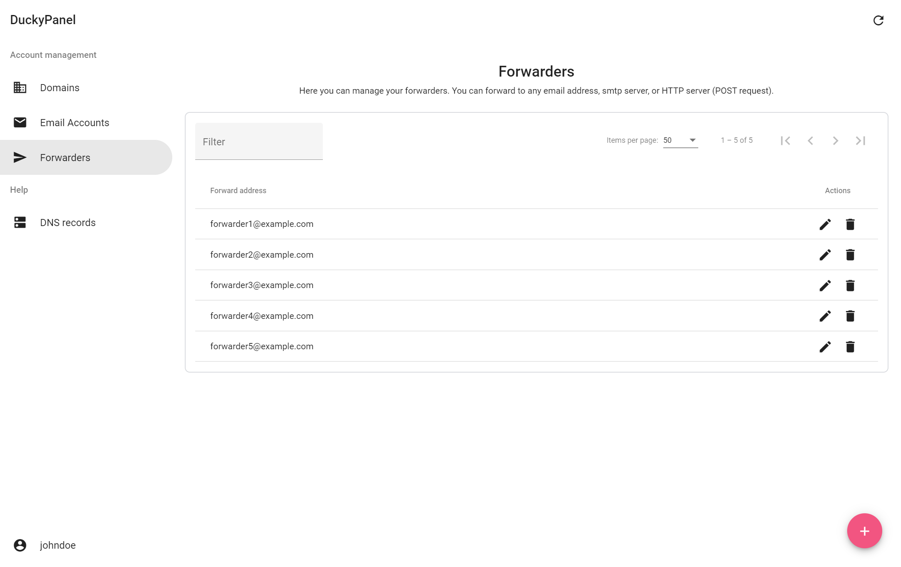
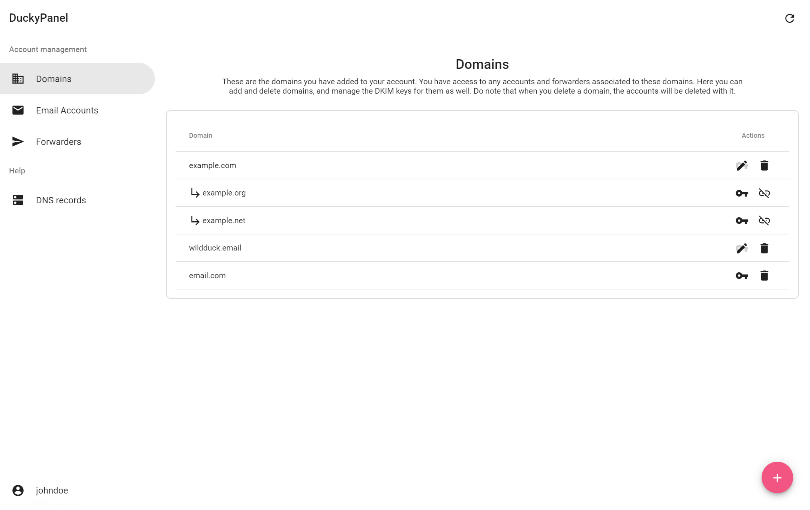
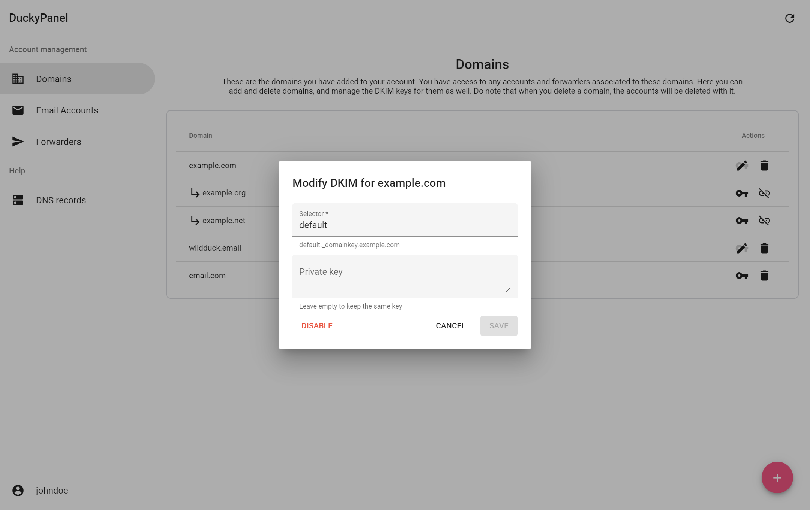
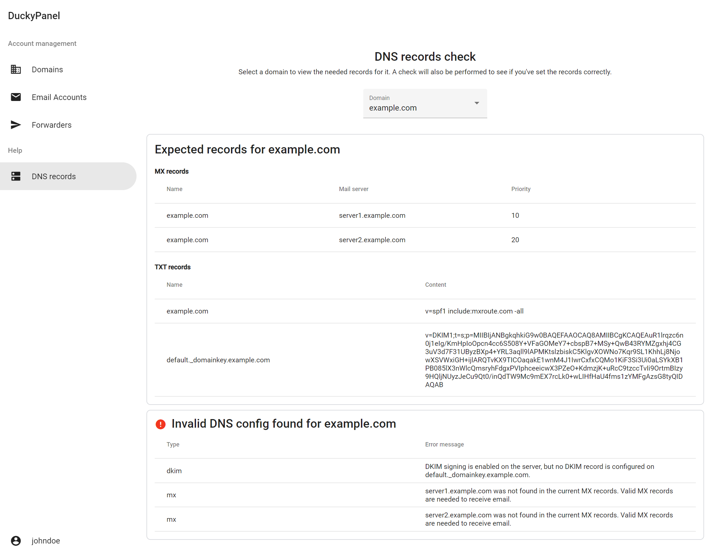
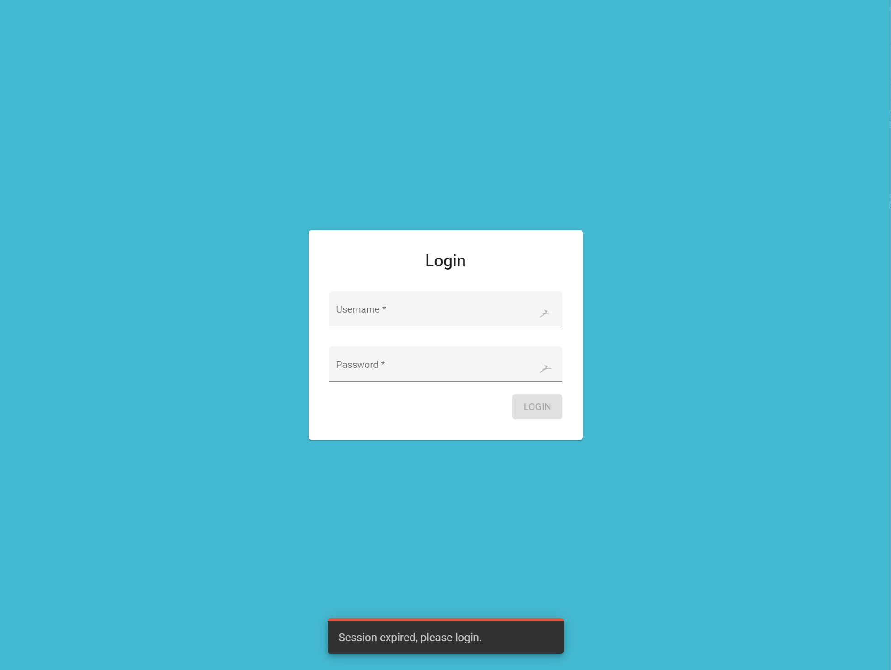

__NOTE:__ This project is still a work in progress. You can already check it out if you're curious, but I can't guarantee it will work out for you.
# DuckyPanel

Duckypanel is a domain admin level control panel for the modern [WildDuck email server](https://wildduck.email/). DuckyPanel is _just_ an Angular frontend project. It uses the [DuckyAPI REST API](https://github.com/louis-lau/DuckyAPI) as the backend. Later on there will be a way to set the DuckyAPI url in a config file, right now you can just edit it in `src/app/app.module.ts`.

## Current features
_Things currently working in DuckyPanel and DuckyAPI._
* Authentication
* API keys allow you to easily call DuckyAPI
* Packages that allow you to set user quotas, currently only for show. Noting happens when going over quota.
* Domain management, including domain aliases
* Deletes aliased domains, accounts, forwarders and DKIM when deleting a domain
* Manage DKIM for the domains
* Domains can not be added to multiple accounts
* Email account management
* Forwarder management
* Only allows seeing/editing of accounts/forwarders on a domain if that domain is added to the account
* Get expected DNS records for a domain, and check the currently published records
* Sorting and filtering

More to come!

## Screenshots

<details>

<summary>Click here for more screenshots</summary>










</details>

## Dependencies
* Node.js
* [DuckyAPI](https://github.com/louis-lau/DuckyAPI)
* A web server (if in production)

## Installation
```bash
$ git clone https://github.com/louis-lau/DuckyPanel
$ npm install
```

## Build

Run `npm run ng build` to build the project. The build artifacts will be stored in the `dist/` directory. Use the `--prod` flag for a production build.

After building you can serve DuckyPanel with any webserver you're comfortable with. Make sure you set it up to rewrite urls to Angular's index.html, you can find multiple examples for this online. DuckyPanel won't function by itself, it needs [DuckyAPI](https://github.com/louis-lau/DuckyAPI) as listed in the dependencies. Don't forget to change the url to DuckyAPI in `src/app/app.module.ts`

## Development server

Run `npm run ng serve` for a dev server. Navigate to `http://localhost:4200/`. The app will automatically reload if you change any of the source files.

