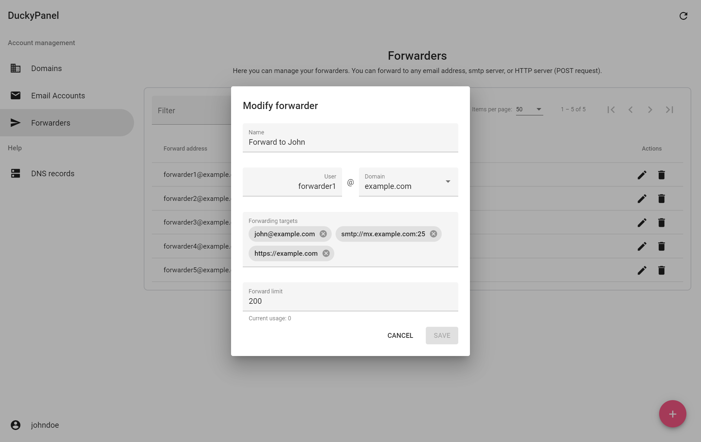
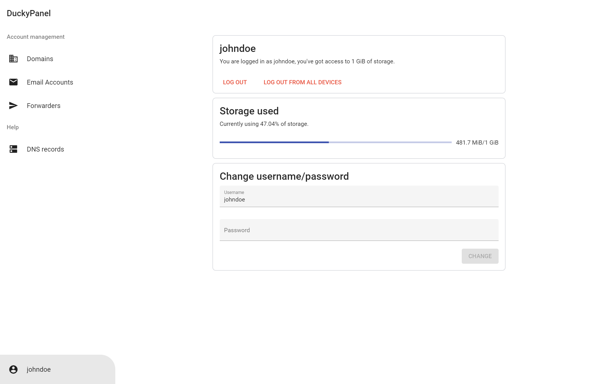
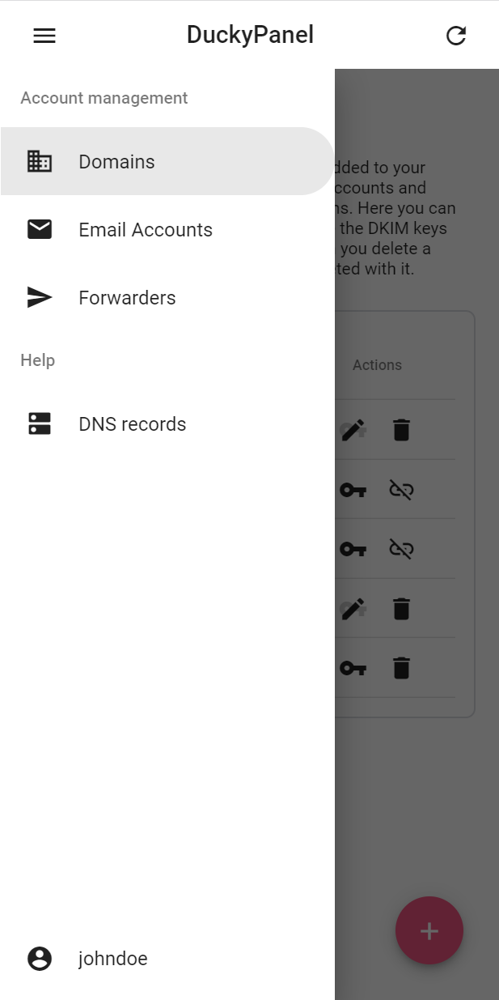

__NOTE:__ This project is still a work in progress. You can already check it out if you're curious, but I can't guarantee it will work out for you.
# DuckyPanel

Duckypanel is a domain admin level control panel for the modern [WildDuck email server](https://wildduck.email/). DuckyPanel is _just_ an Angular frontend project. It uses the [DuckyAPI REST API](https://github.com/louis-lau/DuckyAPI) as the backend.

## Current features
_Things currently working in DuckyPanel and DuckyAPI._
* Authentication
* API keys allow you to easily call DuckyAPI
* Packages that allow you to set user quotas, currently only for show. Nothing happens when going over quota.
* Domain management, including domain aliases
* Deletes aliased domains, accounts, forwarders and DKIM when deleting a domain
* Manage DKIM for the domains
* Email account management
* Forwarder management
* Only allows seeing/editing of accounts/forwarders on a domain if that domain is added to the account
* Domains can not be added to multiple accounts
* Get expected DNS records for a domain, and check the currently published records
* Sorting and filtering

More to come!

## Screenshots

<details>

<summary>Click here for more screenshots</summary>








</details>

## Dependencies
* [DuckyAPI](https://github.com/louis-lau/DuckyAPI)
* A web server (if in production)
* Node.js (if in development)

## Option 1: Serve DuckyPanel from DuckyApi
Very easy to get started with. See the instructions [here](https://github.com/louis-lau/DuckyAPI/blob/master/README.md#integrated-duckypanel).

## Option 2: Serve DuckyPanel seperately from DuckyApi
Recommended if you want to scale and distribute the applications differently. As an example you could host DuckyPanel on a fast CDN.

#### Get it
Get the latest release [here](https://github.com/louis-lau/DuckyPanel/releases) and unzip it.

#### Configure it
Copy [config/example.json](src/config/example.json) to `config/production.json`. Then edit `apiUrl` to be your **publically** accessible url of [DuckyAPI](https://github.com/louis-lau/DuckyAPI), so DuckyPanel knows where to reach it.

#### Serve it
Now you can serve DuckyPanel with any webserver you're comfortable with. You will need to configure the server to fall back to `index.html` for the routing to work properly. [Here](https://angular.io/guide/deployment#fallback-configuration-examples) are some configuration examples for the most popular web servers. 

## Development

#### Install it
```bash
$ git clone https://github.com/louis-lau/DuckyPanel
$ npm install
```

#### Configure it
Copy [src/config/example.json](src/config/example.json) to `src/config/development.json`. Then edit `apiUrl` to be your DuckyApi url.

#### Start hacking!
Run `npm start` for a dev server. Navigate to `http://localhost:4200/`. The app will automatically reload if you change any of the source files. Do **not** use this in production.

